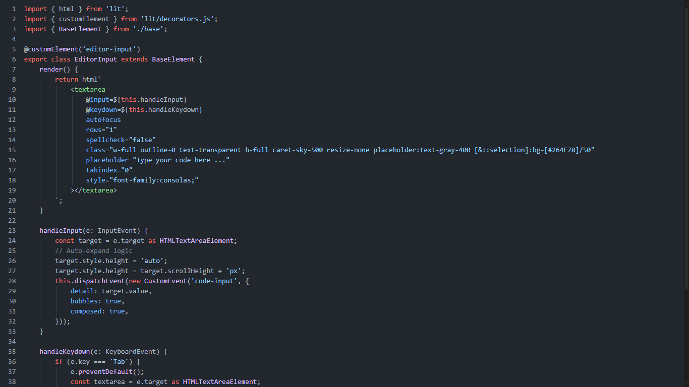

# My Editor

A simple web-based code editor built with Lit, Vite, and Tailwind CSS. It features live syntax highlighting (using highlight.js), line numbers, and a modern UI.



## Features
- Live syntax highlighting for JavaScript (and other languages supported by highlight.js)
- Auto-expanding textarea for code input
- Overlay rendering for real-time highlighted output
- Custom line numbers component
- Built with Lit Web Components
- Styled with Tailwind CSS

## Getting Started

### Prerequisites
- Node.js (v18 or newer recommended)
- npm

### Installation
```bash
npm install
```

### Development
Start the development server:
```bash
npm run dev
```
Open [http://localhost:5173](http://localhost:5173) in your browser.

### Build
To build for production:
```bash
npm run build
```

### Preview Production Build
```bash
npm run preview
```

## Project Structure
```
my-editor/
├── index.html
├── preview.png
├── package.json
├── src/
│   ├── index.css
│   ├── my-element.ts
│   └── ui/
│       ├── base.ts
│       ├── editor-input.ts
│       ├── editor-output.ts
│       ├── editor-linenumbers.ts
│       └── text-editor.ts
│   └── utils/
│       ├── highlighter.ts
│       └── language.ts
└── ...
```

## Customization
- To change the syntax highlighting theme, import a different CSS file from `highlight.js/styles/` in your `index.css` or main entry file.
- To add more languages, ensure highlight.js supports them and update the `language` property as needed.

## License
MIT
